<h2>Bandit</h2>

<u>**_Level 0_**</u>

The goal of this level is for you to log into the game using SSH. The host to which you need to connect is **bandit.labs.overthewire.org**, on port **2220**. The username is **bandit0** and the password is **bandit0**. Once logged in, go to the Level 1 page to find out how to beat Level 1.

Use command `ssh bandit0@bandit.labs.overthewire.org -p 2220` and enter `bandit0` when password is asked.

<u>**_Level 0 -> Level 1_**</u>

The password for the next level is stored in a file called **readme** located in the home directory. Use this password to log into bandit1 using SSH. Whenever you find a password for a level, use SSH (on port 2220) to log into that level and continue the game.

```
ssh bandit0@bandit.labs.overthewire.org -p 2220
password: bandit0
```

Approach: `cat readme` to see the contents of readme file

<u>**_Level 1 -> Level 2_**</u>

The password for the next level is stored in a file called **-** located in the home directory

```
ssh bandit1@bandit.labs.overthewire.org -p 2220
password: NH2SXQwcBdpmTEzi3bvBHMM9H66vVXjL
```

Approach:

- ls -la to see everything in the directory. You can see the file -
- You can open the file named - like so:

```
cat < -
```

<u>**_Level 2 -> Level 3_**</u>

The password for the next level is stored in a file called **spaces in this filename** located in the home directory

```
ssh bandit2@bandit.labs.overthewire.org -p 2220
rRGizSaX8Mk1RTb1CNQoXTcYZWU6lgzi
```

Approach:

```
cat "spaces in this filename"
```

<u>**_Level 3 -> Level 4_**</u>

The password for the next level is stored in a hidden file in the **inhere** directory.

```
ssh bandit3@bandit.labs.overthewire.org -p 2220
password: aBZ0W5EmUfAf7kHTQeOwd8bauFJ2lAiG
```

Approach:

**_ls -la_** command inside the **inhere** directory

<u>**_Level 4 -> Level 5_**</u> OK?

The password for the next level is stored in the only human-readable file in the inhere directory. Tip: if your terminal is messed up, try the “reset” command.

```
ssh bandit4@bandit.labs.overthewire.org -p 2220
password: 2EW7BBsr6aMMoJ2HjW067dm8EgX26xNe
```

How I approach this problem:

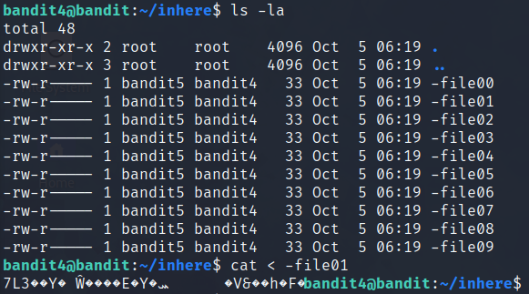

Approach:

- You can open each file with `cat < -file0X` but it is not an efficient way of doing things..
- Command `file -- *` work nice because it examines each file in the current directory and attempts to identify its file type based on characteristics like file contents and metadata. It then displays this information for each file in the output.

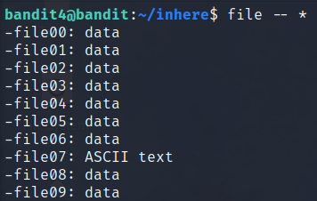

Approach:

1. use command `file -- *` in **inhere** directory
2. read the file **-file07** with command `cat < -file07`

**_In bigger context you can use this command_**: `find . -type f -exec file {} \; | grep text`. This command searches for files in the specified directory and its subdirectories and executes the command for each file. `grep text` filters and displays only files identified as text or human-readable.

<u>**_Level 5 -> Level 6_**</u>

The password for the next level is stored in a file somewhere under the inhere directory and has all of the following properties:

- human-readable
- 1033 bytes in size
- not executable

```
ssh bandit5@bandit.labs.overthewire.org -p 2220
password: lrIWWI6bB37kxfiCQZqUdOIYfr6eEeqR
```

I liked this one. Inside this directory you have many subdirectories that have files inside those. That is why you have to start using those commands. After a while I used this command to find the file that has the password in:

```
find . -type f -size 1033c -readable ! -executable
OR
find . -type f -size 1033c ! -executable -exec file {} \; | grep text (used in previous level)
```

shortly about this command:

- -type f searches for files
- -size 1033c searches files that are 1033 bytes in size
- ! executable is not an executable file


<u>**_Level 6 -> Level 7_**</u>

```
ssh bandit6@bandit.labs.overthewire.org -p 2220
password: P4L4vucdmLnm8I7Vl7jG1ApGSfjYKqJU
```

The password for the next level is stored **somewhere on the server** and has all of the following properties:

- owned by user bandit7
- owned by group bandit6
- 33 bytes in size

Approach:

Luckily I have studied Linux Fundamentals from the site called [Hack The Box](https://www.hackthebox.com/) so I could use a one little trick that learned from there and that is how to exclude lines with "Permission denied". Add `-exec ls -al {} \; 2>/dev/null` after the properties given in the description:

`find / -size 33c -user bandit7 -group bandit6 -exec ls -al {} \; 2>/dev/null`


<u>**_Level 7 -> Level 8_**</u>

The password for the next level is stored in the file **data.txt** next to the word **millionth**

```
ssh bandit7@bandit.labs.overthewire.org -p 2220
password: z7WtoNQU2XfjmMtWA8u5rN4vzqu4v99S
```

Approach: If we take the first 10 lines you can see a user and a password like so:

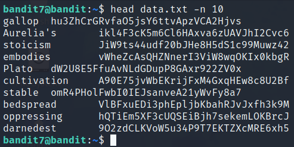

And trust me, there are a lot of lines. My idea is to print the line that has the word "millionth" in it.

After reading the grep commands manual we can find the line with specific word like so: `grep "millionth" data.txt`. And you get only one result.

<u>**_Level 8 -> Level 9_**</u>

The password for the next level is stored in the file **data.txt** and is the only line of text that occurs only once

```
ssh bandit8@bandit.labs.overthewire.org -p 2220
password: TESKZC0XvTetK0S9xNwm25STk5iWrBvP
```

Approach: Let's see what is inside the data.txt file. Let's print the first 10 lines first.

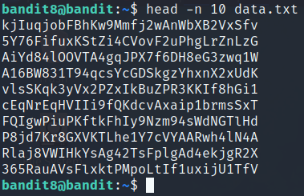

Okay, one idea is to sort the file and use the command uniq with argument -u to filter out the unique lines in the file. The command for this is `sort data.txt | uniq -u`. And it seems to give only one match which works.

<u>**_Level 9 -> Level 10_**</u>

The password for the next level is stored in the file **data.txt** in one of the few human-readable strings, preceded by several ‘=’ characters.

```
ssh bandit9@bandit.labs.overthewire.org -p 2220
password: EN632PlfYiZbn3PhVK3XOGSlNInNE00t
```

Approach: Let's see some of the file's contents

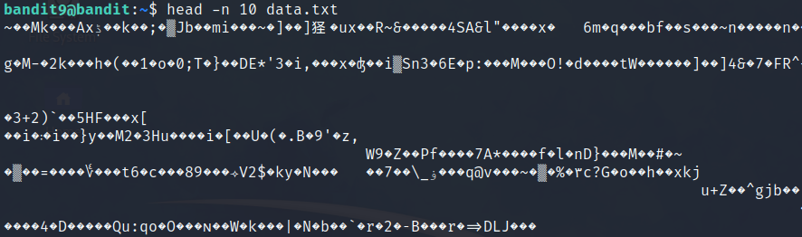

Yeah this one is not human-readable so we have to think about something else.

`strings -n 8 data.txt | grep -E "^={3,}[^=]+" | sed 's/^=*//'`

You get three results and one of them is the password.

<u>**_Tätä kohtaa voi sitten hioa, kun osaamista on enemmän :)_**</u>

<u>**_Level 10 -> Level 11_**</u>

The password for the next level is stored in the file **data.txt**, which contains base64 encoded data

```
ssh bandit10@bandit.labs.overthewire.org -p 2220
password: G7w8LIi6J3kTb8A7j9LgrywtEUlyyp6s
```

Approach: To see what is inside the data.txt file we can see the following

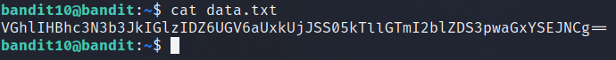

Time to learn how to read base64 encoded data. Let's use the `man base64` to read how it works.

Well, this was really straightforward. Use command `base64 -d data.txt` to decode the file.

<u>**_Level 11 -> Level 12_**</u>

The password for the next level is stored in the file **data.txt**, where all lowercase (a-z) and uppercase (A-Z) letters have been rotated by 13 positions

```
ssh bandit11@bandit.labs.overthewire.org -p 2220
password: 6zPeziLdR2RKNdNYFNb6nVCKzphlXHBM
```

Approach: Like always let's see what is inside the data.txt file. The output is the following:

`Gur cnffjbeq vf WIAOOSFzMjXXBC0KoSKBbJ8puQm5lIEi`

After few google searches I found ROT13 decoder (<b>Rot</b>ate <b>13</b> letters) that seems to be our answer. I put the string to this [website](https://rot13.com/) that decoded it and I found the password. But to use that ROT13 decoder in linux I had to watch a video or two to learn how it really works. You can try for example the following:

`cat data.txt | tr 'A-Za-z' 'N-ZA-Mn-za-m'` read the file first and then rotate the letters by 13 positions **OR**
`tr 'A-Za-z' 'N-ZA-Mn-za-m' < data.txt` to rotate the letters and then print the output to the command line. I liked the first one more.

<u>**_Level 12 -> Level 13_**</u>

The password for the next level is stored in the file **data.txt**, which is a hexdump of a file that has been repeatedly compressed. For this level it may be useful to create a directory under /tmp in which you can work using mkdir. For example: mkdir /tmp/myname123. Then copy the datafile using cp, and rename it using mv (read the manpages!)

```
ssh bandit12@bandit.labs.overthewire.org -p 2220
password: JVNBBFSmZwKKOP0XbFXOoW8chDz5yVRv
```

Approach: Taking a copy of a file is good backup measure in case something goes wrong. After making a copy (and moving it to a new directory in /tmp/) we can start doing things.

After reading some commands I found that command **xxd** can convert a hex dump back to its original binary form. Let's try that.

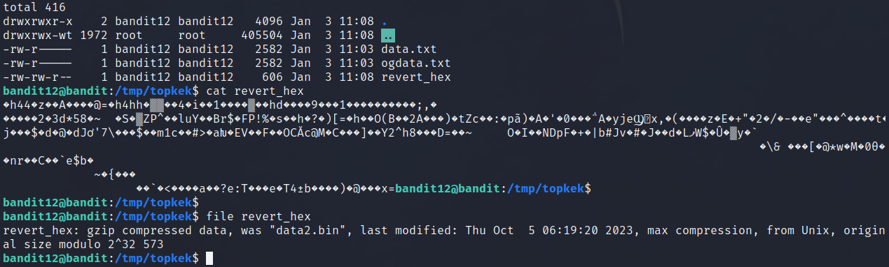

After convert I can see that the file's contents has changed. As I looked the file with command `file` I can notice that it is gzip compressed file. So let's do something about that next.

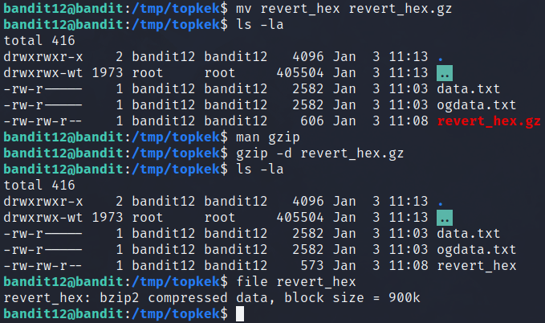

Now that I have added .gz extension to the file and decompressed it with command `gzip -d` I can see that now it is bzip2 compressed data. So now let's do the same thing again (I guess) but with bzip2.

After doing the trick with bzip2 (added .bz extension, decompress it with command `bzip2 -d` and use `file` command) it says that it is gzip compressed data once again.

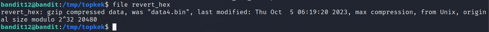

Let's repeat same thing and see what happens next..

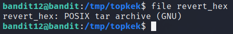

Well, now I can see that it has changed to tar archieve. Let's read manual for command `tar` to see what's next.

To extract the file(s) from the tar I had to change the file type (added .tar) and then used this command: `tar -xvf revert_hex.tar`. -x for extract, -v for verbose and -f for file. After that it extracted a data5.bin file which is also tar archieve.

Did the same trick for the data5.bin (added .tar extension and command above) and I got the data6.bin which was bzip compressed data. Now I'm doing the same things until either encounter a new thing or get the password.

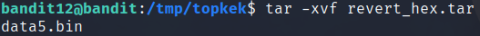

After a while we got to a point where we finally got the file that was ASCII text (when checked with `file` command). After opening that file with `cat` command we found the password for the next level.

<u>**_Level 13 -> Level 14_**</u>

The password for the next level is stored in **/etc/bandit_pass/bandit14** and can only be read by user bandit14. For this level, you don’t get the next password, but you get a private SSH key that can be used to log into the next level. **Note: localhost** is a hostname that refers to the machine you are working on

```
ssh bandit13@bandit.labs.overthewire.org -p 2220
password: wbWdlBxEir4CaE8LaPhauuOo6pwRmrDw
```
