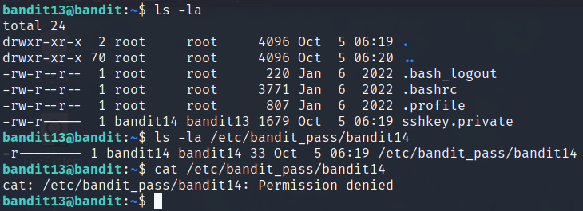
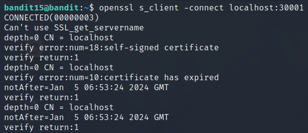
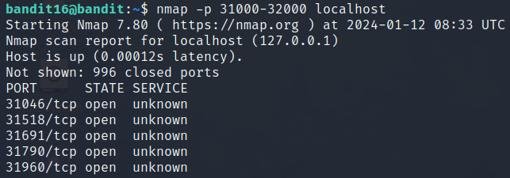
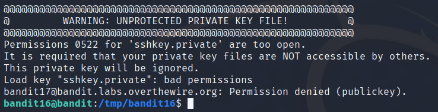
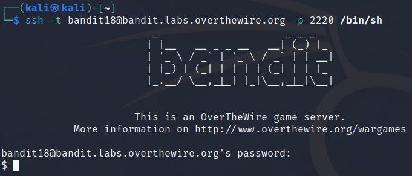
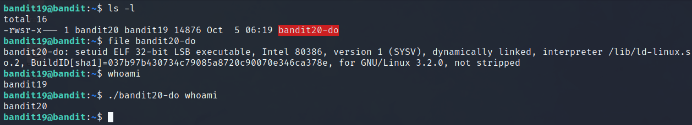
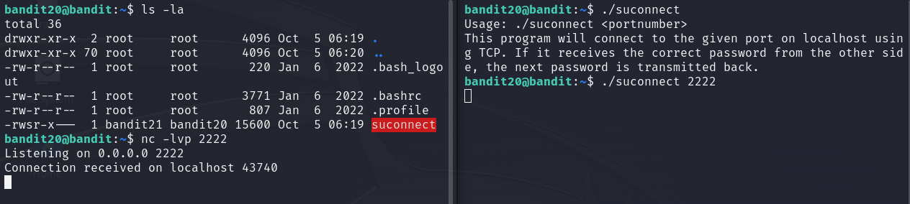

<h2>Bandit</h2>

<u>**_Level 0_**</u>

The goal of this level is for you to log into the game using SSH. The host to which you need to connect is **bandit.labs.overthewire.org**, on port **2220**. The username is **bandit0** and the password is **bandit0**. Once logged in, go to the Level 1 page to find out how to beat Level 1.

Use command `ssh bandit0@bandit.labs.overthewire.org -p 2220` and enter `bandit0` when password is asked.

<u>**_Level 0 -> Level 1_**</u>

The password for the next level is stored in a file called **readme** located in the home directory. Use this password to log into bandit1 using SSH. Whenever you find a password for a level, use SSH (on port 2220) to log into that level and continue the game.

```
ssh bandit0@bandit.labs.overthewire.org -p 2220
password: bandit0
```

Approach: `cat readme` to see the contents of readme file

<u>**_Level 1 -> Level 2_**</u>

The password for the next level is stored in a file called **-** located in the home directory

```
ssh bandit1@bandit.labs.overthewire.org -p 2220
password: NH2SXQwcBdpmTEzi3bvBHMM9H66vVXjL
```

Approach:

- ls -la to see everything in the directory. You can see the file -
- You can open the file named - like so:

```
cat < -
```

<u>**_Level 2 -> Level 3_**</u>

The password for the next level is stored in a file called **spaces in this filename** located in the home directory

```
ssh bandit2@bandit.labs.overthewire.org -p 2220
rRGizSaX8Mk1RTb1CNQoXTcYZWU6lgzi
```

Approach:

```
cat "spaces in this filename"
```

<u>**_Level 3 -> Level 4_**</u>

The password for the next level is stored in a hidden file in the **inhere** directory.

```
ssh bandit3@bandit.labs.overthewire.org -p 2220
password: aBZ0W5EmUfAf7kHTQeOwd8bauFJ2lAiG
```

Approach:

**_ls -la_** command inside the **inhere** directory

<u>**_Level 4 -> Level 5_**</u> OK?

The password for the next level is stored in the only human-readable file in the inhere directory. Tip: if your terminal is messed up, try the “reset” command.

```
ssh bandit4@bandit.labs.overthewire.org -p 2220
password: 2EW7BBsr6aMMoJ2HjW067dm8EgX26xNe
```

How I approach this problem:


Approach:

- You can open each file with `cat < -file0X` but it is not an efficient way of doing things..
- Command `file -- *` work nice because it examines each file in the current directory and attempts to identify its file type based on characteristics like file contents and metadata. It then displays this information for each file in the output.


Approach:

1. use command `file -- *` in **inhere** directory
2. read the file **-file07** with command `cat < -file07`

**_In bigger context you can use this command_**: `find . -type f -exec file {} \; | grep text`. This command searches for files in the specified directory and its subdirectories and executes the command for each file. `grep text` filters and displays only files identified as text or human-readable.

<u>**_Level 5 -> Level 6_**</u>

The password for the next level is stored in a file somewhere under the inhere directory and has all of the following properties:

- human-readable
- 1033 bytes in size
- not executable

```
ssh bandit5@bandit.labs.overthewire.org -p 2220
password: lrIWWI6bB37kxfiCQZqUdOIYfr6eEeqR
```

I liked this one. Inside this directory you have many subdirectories that have files inside those. That is why you have to start using those commands. After a while I used this command to find the file that has the password in:

```
find . -type f -size 1033c -readable ! -executable
OR
find . -type f -size 1033c ! -executable -exec file {} \; | grep text (used in previous level)
```

shortly about this command:

- -type f searches for files
- -size 1033c searches files that are 1033 bytes in size
- ! executable is not an executable file


<u>**_Level 6 -> Level 7_**</u>

```
ssh bandit6@bandit.labs.overthewire.org -p 2220
password: P4L4vucdmLnm8I7Vl7jG1ApGSfjYKqJU
```

The password for the next level is stored **somewhere on the server** and has all of the following properties:

- owned by user bandit7
- owned by group bandit6
- 33 bytes in size

Approach:

Luckily I have studied Linux Fundamentals from the site called [Hack The Box](https://www.hackthebox.com/) so I could use a one little trick that learned from there and that is how to exclude lines with "Permission denied". Add `-exec ls -al {} \; 2>/dev/null` after the properties given in the description:

`find / -size 33c -user bandit7 -group bandit6 -exec ls -al {} \; 2>/dev/null`


<u>**_Level 7 -> Level 8_**</u>

The password for the next level is stored in the file **data.txt** next to the word **millionth**

```
ssh bandit7@bandit.labs.overthewire.org -p 2220
password: z7WtoNQU2XfjmMtWA8u5rN4vzqu4v99S
```

Approach: If we take the first 10 lines you can see a user and a password like so:


And trust me, there are a lot of lines. My idea is to print the line that has the word "millionth" in it.

After reading the grep commands manual we can find the line with specific word like so: `grep "millionth" data.txt`. And you get only one result.

<u>**_Level 8 -> Level 9_**</u>

The password for the next level is stored in the file **data.txt** and is the only line of text that occurs only once

```
ssh bandit8@bandit.labs.overthewire.org -p 2220
password: TESKZC0XvTetK0S9xNwm25STk5iWrBvP
```

Approach: Let's see what is inside the data.txt file. Let's print the first 10 lines first.


Okay, one idea is to sort the file and use the command uniq with argument -u to filter out the unique lines in the file. The command for this is `sort data.txt | uniq -u`. And it seems to give only one match which works.

<u>**_Level 9 -> Level 10_**</u>

The password for the next level is stored in the file **data.txt** in one of the few human-readable strings, preceded by several ‘=’ characters.

```
ssh bandit9@bandit.labs.overthewire.org -p 2220
password: EN632PlfYiZbn3PhVK3XOGSlNInNE00t
```

Approach: Let's see some of the file's contents


Yeah this one is not human-readable so we have to think about something else.

`strings -n 8 data.txt | grep -E "^={3,}[^=]+" | sed 's/^=*//'`

You get three results and one of them is the password.

<u>**_Level 10 -> Level 11_**</u>

The password for the next level is stored in the file **data.txt**, which contains base64 encoded data

```
ssh bandit10@bandit.labs.overthewire.org -p 2220
password: G7w8LIi6J3kTb8A7j9LgrywtEUlyyp6s
```

Approach: To see what is inside the data.txt file we can see the following


Time to learn how to read base64 encoded data. Let's use the `man base64` to read how it works.

Well, this was really straightforward. Use command `base64 -d data.txt` to decode the file.

<u>**_Level 11 -> Level 12_**</u>

The password for the next level is stored in the file **data.txt**, where all lowercase (a-z) and uppercase (A-Z) letters have been rotated by 13 positions

```
ssh bandit11@bandit.labs.overthewire.org -p 2220
password: 6zPeziLdR2RKNdNYFNb6nVCKzphlXHBM
```

Approach: Like always let's see what is inside the data.txt file. The output is the following:

`Gur cnffjbeq vf WIAOOSFzMjXXBC0KoSKBbJ8puQm5lIEi`

After few google searches I found ROT13 decoder (<b>Rot</b>ate <b>13</b> letters) that seems to be our answer. I put the string to this [website](https://rot13.com/) that decoded it and I found the password. But to use that ROT13 decoder in linux I had to watch a video or two to learn how it really works. You can try for example the following:

`cat data.txt | tr 'A-Za-z' 'N-ZA-Mn-za-m'` read the file first and then rotate the letters by 13 positions **OR**
`tr 'A-Za-z' 'N-ZA-Mn-za-m' < data.txt` to rotate the letters and then print the output to the command line. I liked the first one more.

<u>**_Level 12 -> Level 13_**</u>

The password for the next level is stored in the file **data.txt**, which is a hexdump of a file that has been repeatedly compressed. For this level it may be useful to create a directory under /tmp in which you can work using mkdir. For example: mkdir /tmp/myname123. Then copy the datafile using cp, and rename it using mv (read the manpages!)

```
ssh bandit12@bandit.labs.overthewire.org -p 2220
password: JVNBBFSmZwKKOP0XbFXOoW8chDz5yVRv
```

Approach: Taking a copy of a file is good backup measure in case something goes wrong. After making a copy (and moving it to a new directory in /tmp/) we can start doing things.

After reading some commands I found that command **xxd** can convert a hex dump back to its original binary form. Let's try that.


After convert I can see that the file's contents has changed. As I looked the file with command `file` I can notice that it is gzip compressed file. So let's do something about that next.


Now that I have added .gz extension to the file and decompressed it with command `gzip -d` I can see that now it is bzip2 compressed data. So now let's do the same thing again (I guess) but with bzip2.

After doing the trick with bzip2 (added .bz extension, decompress it with command `bzip2 -d` and use `file` command) it says that it is gzip compressed data once again.


Let's repeat same thing and see what happens next..


Well, now I can see that it has changed to tar archieve. Let's read manual for command `tar` to see what's next.

To extract the file(s) from the tar I had to change the file type (added .tar) and then used this command: `tar -xvf revert_hex.tar`. -x for extract, -v for verbose and -f for file. After that it extracted a data5.bin file which is also tar archieve.

Did the same trick for the data5.bin (added .tar extension and command above) and I got the data6.bin which was bzip compressed data. Now I'm doing the same things until either encounter a new thing or get the password.


After a while we got to a point where we finally got the file that was ASCII text (when checked with `file` command). After opening that file with `cat` command we found the password for the next level.

<u>**_Level 13 -> Level 14_**</u>

The password for the next level is stored in **/etc/bandit_pass/bandit14** and can only be read by user bandit14. For this level, you don’t get the next password, but you get a private SSH key that can be used to log into the next level. **Note: localhost** is a hostname that refers to the machine you are working on

```
ssh bandit13@bandit.labs.overthewire.org -p 2220
password: wbWdlBxEir4CaE8LaPhauuOo6pwRmrDw
```

Approach:

In current home directory (bandit13) I can read the private sshkey that belongs to user bandit14. I can't read the contents of a file that is at /etc/bandit_pass/bandit14 because of the restrictions.



But after a bit of studying I can log in as user bandit14 with the following command: `ssh bandit14@bandit.labs.overthewire.org -i sshkey.private -p 2220`

Do note that this command works when I am at the home directory of bandit13. After that I am logged in as user bandit14 and I can read the contents of a file that is at /etc/bandit_pass/bandit14.

<u>**_Level 14 -> Level 15_**</u>

The password for the next level can be retrieved by submitting the password of the current level to **port 30000 on localhost.**

```
ssh bandit14@bandit.labs.overthewire.org -p 2220
password: fGrHPx402xGC7U7rXKDaxiWFTOiF0ENq
```

Approach: I read the command hinted in the task and found that command **nc** is useful for this task. You need to specify a destination and a port as arguments for the command like so:

`nc localhost 30000`

After this I got a little confused because it seemed like nothing happened but when I pressed enter I got an error message "Wrong! Please enter the correct current password". After putting the current password I got the password for the next level. Hurray!

<u>**_Level 15 -> Level 16_**</u>

The password for the next level can be retrieved by submitting the password of the current level to port **30001 on localhost** using SSL encryption.

Helpful note: Getting “HEARTBEATING” and “Read R BLOCK”? Use -ign_eof and read the “CONNECTED COMMANDS” section in the manpage. Next to ‘R’ and ‘Q’, the ‘B’ command also works in this version of that command…

```
ssh bandit15@bandit.labs.overthewire.org -p 2220
password: jN2kgmIXJ6fShzhT2avhotn4Zcka6tnt
```

Approach: After again reading some manuals I found that command `s_client` was part of `openssl` command. And getting the manual from `s_client` was a bit tricky to get (that worked with command `man openssl-s_client `). `s_client` is a command that implements a generic SSL/TLS client which connects to a remote host using SSL/TLS. In this case I have to use an argument `-connect host:port` which specifies the host and optional port to connect to. After this command `openssl s_client -connect localhost:30001` we we see something like this:



It continues (a lot, actually) and in the end of this whole output you get a text "read R BLOCK". When enter any string to it and press enter you will get an error saying "Wrong! Please enter the correct current password". After entering the current password you will get a password for the next level.

<u>**_Level 16 -> Level 17_**</u>

The credentials for the next level can be retrieved by submitting the password of the current level to **a port on localhost in the range 31000 to 32000**. First find out which of these ports have a server listening on them. Then find out which of those speak SSL and which don’t. There is only 1 server that will give the next credentials, the others will simply send back to you whatever you send to it.

```
ssh bandit16@bandit.labs.overthewire.org -p 2220
password: JQttfApK4SeyHwDlI9SXGR50qclOAil1
```

Approach: I would guess that `nmap` works in this situation. Let's try that command and use the argument `-p` to specify the range of ports we are scanning.



As a result I get five ports that are open but the services are unknown. Next I would try the command used in previous level which is `openssl`.

When connecting to each of these ports one port gives you a private key that we can (hopefully) use to get the password for the next level. In the previous levels I have learned that it is possible to create a directory to the /tmp/ directory. I will make a directory there and copy the contents of a private ssh key to a file within that directory and then hopefully I can get into the next level.

Okay, after the steps I mentioned I tried to log in to the next level but I got an error that the "Permissions are too open".



After changing correct permissions for the file I got in to the next level. Hurray!

<u>**_Level 17 -> Level 18_**</u>

There are 2 files in the homedirectory: **passwords.old and passwords**.new. The password for the next level is in **passwords.new** and is the only line that has been changed between **passwords.old and passwords.new**

**NOTE: if you have solved this level and see ‘Byebye!’ when trying to log into bandit18, this is related to the next level, bandit19**

```
ssh bandit17@bandit.labs.overthewire.org -p 2220
password: VwOSWtCA7lRKkTfbr2IDh6awj9RNZM5e
```

Approach: Level hints and commands I may need to solve this level are `cat`, `grep`, `ls` and `diff`. I think that `diff` is the command we need for this level.

After command `diff passwords.old passwords.new` I got output something like this:

```
< STRING
---
> STRING
```

String that is after < means that the string is in passwords.old file and the string after > is in passwords.new file.

Well I accidentally got a "Byebye !" message after loggin in with bandit18 using the new password `hga5tuuCLF6fFzUpnagiMN8ssu9LFrdg`. As the description of the level says, this is related to the next level, bandit19.

<u>**_Level 18 -> Level 19_**</u>

The password for the next level is stored in a file `readme` in the homedirectory. Unfortunately, someone has modified `.bashrc` to log you out when you log in with SSH.

Approach:

I tried different ideas like e.g.

- move the files to the /tmp/ directory and try ssh from there with changed permissions
- tried to modify the contents of a file
- tried `openssh`

But then I remembered that `ssh` has a parameter `-t` which forces pseudo-terminal allocation. I tried that with `/bin/sh` and I got in.



Now we can use the basic commands like `ls` and `cat` to see find the password for the next level.

<u>**_Level 19 -> Level 20_**</u>

To gain access to the next level, you should use the setuid binary in the homedirectory. Execute it without arguments to find out how to use it. The password for this level can be found in the usual place (/etc/bandit_pass), after you have used the setuid binary.

```
ssh bandit19@bandit.labs.overthewire.org -p 2220
password: awhqfNnAbc1naukrpqDYcF95h7HoMTrC
```

Approach:

With command `ls -l` I can see that there is `s` in privileges instead of `x`. With command `file` I can see that the file has setuid placed. And after the command `./bandit20-do whoami` I can confirm to have the bandit20 access.

The thing is that whoever runs the file bandit20-do inherits (temporarily) the same permissions as the owner of the file.



With all this information I can read the password for the next level using the following command `./bandit20-do cat /etc/bandit_pass/bandit20`. Hurray!

<u>**_Level 20 -> Level 21_**</u>

There is a setuid binary in the homedirectory that does the following: it makes a connection to localhost on the port you specify as a commandline argument. It then reads a line of text from the connection and compares it to the password in the previous level (bandit20). If the password is correct, it will transmit the password for the next level (bandit21).

NOTE: Try connecting to your own network daemon to see if it works as you think

```
ssh bandit20@bandit.labs.overthewire.org -p 2220
password: VxCazJaVykI6W36BkBU0mJTCM8rR95XT
```

Approach: After reading the previous levels, I see a command `nc` that I used in one of the previous levels. After reading the command, I notice a couple of things:

- It can act as a server, in which case it needs to open a port to communicate with another device
- A few switches help with this task:
  - `-l` is for listening,
  - `-p` is for specifying the port,
  - `-v` is for producing more verbose output.

With this information, I do the following:

- I'll open an extra terminal. I set the second terminal as a server to listen to the port I want and on the other terminal I connect to the server by sending the file `suconnect`
- If the connection works, I will send the password on the server and see what happens

NOTE: The terminal on the left acts as a server, the one on the right sends the file to the server



Great, the connection is working. I send the password from the server and hopefully I get a new password for the next level in response. Which I got indeed!

<u>**_Level 21 -> Level 22_**</u>

A program is running automatically at regular intervals from cron, the time-based job scheduler. Look in /etc/cron.d/ for the configuration and see what command is being executed.

```
ssh bandit21@bandit.labs.overthewire.org -p 2220
password: NvEJF7oVjkddltPSrdKEFOllh9V1IBcq
```
